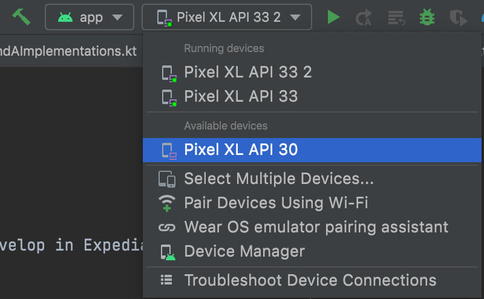
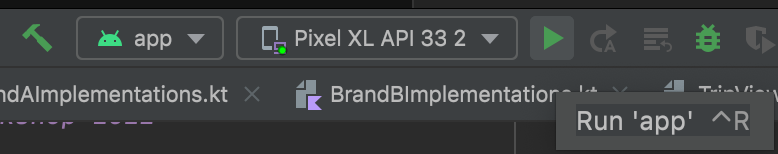

## Welcome to Expedia Groups Women of silicon valley roundabout workshop 2022

### Requirements
- Android Studio 2021.2.1.15 or greater
- Android Simulator API 26 or greater

### Setup
1. Clone the project
2. Open project "wosr2022workshop-starter" with Android Studio
4. On Android Studio, select your emulator

6. Press Play to launch the app in the simulator

## Workshop
This workshop will cover some of the key concepts that we use to develop in Expedia and our drive towards Mobile first development.

### Tech stack
At Expedia we have quite a large tech stack but today we will endeavour to cover some of the most important ones for native app development:
- Compose
- States
- Tokens approach
- Server Driven UI

## Theory and the Why's
We will also answer the questions:
- Why did we choose to change our UI to use Compose before many other applications?
- What were the challenges that we faced by committing to this change.
- How do we customize our code base to handle 23 brands without making a mess of the code and what were our challenges (one codebase 23 brands).
- The power of server driven UI in our apps.